# Salt-and-pepper noise filtering on GPU (CUDA)

Лабораторная работа по дисциплине **«Высокопроизводительные вычисления»**.
Выполнил: 6133-010402D Асташин Сергей Владиславович.

## Описание работы

В работе реализован **9-точечный медианный фильтр** для удаления шума типа **salt-and-pepper** на GPU с использованием **CUDA** и **texture memory**.

Задача:
- взять входное изображение в **градациях серого** в формате **BMP**;
- применить к нему **CUDA-реализацию 9-point median filter**;
- корректно обработать граничные пиксели;
- сохранить результат в **BMP**;
- измерить время обработки на GPU;
- проанализировать результат с помощью таблиц и графиков.

Дополнительно был реализован удобный сценарий для **Google Colab**:
- загрузка обычного изображения;
- автоматическое преобразование в **grayscale BMP**;
- опциональное добавление шума **salt-and-pepper** для демонстрации работы фильтра;
- запуск CUDA-кода;
- построение таблиц и графиков для анализа результата.

---

## Используемые технологии

- **CUDA C++**
- **Google Colab**
- **Python**
- **NumPy**
- **Pillow**
- **Matplotlib**
- **Pandas**
- **scikit-image**

---

## Идея алгоритма

Медианный фильтр хорошо подходит для удаления импульсного шума salt-and-pepper, так как заменяет значение пикселя **медианой** по его локальной окрестности.

В данной работе использован фильтр с окном **3×3**:
- для каждого пикселя берутся 9 значений из его окрестности;
- значения сортируются;
- в выходное изображение записывается **средний элемент отсортированного массива**, то есть медиана.

Для граничных пикселей применяется правило:
- недостающие соседи берутся из **ближайших доступных пикселей**.

---

## Что именно было распараллелено и почему

### Что распараллелено

Основное распараллеливание выполнено **по пикселям изображения**.

Каждый поток GPU:
1. получает координаты одного пикселя `(x, y)`;
2. считывает значения пикселей из окна `3×3`;
3. сортирует 9 элементов;
4. записывает медиану в соответствующую позицию выходного изображения.

### Почему это можно эффективно распараллелить

Эта задача естественно распараллеливается, потому что:
- значение каждого выходного пикселя вычисляется **независимо** от остальных;
- для вычисления не требуется синхронизация между потоками;
- операция одинаковая для всех пикселей изображения.

То есть схема распараллеливания следующая:

- **1 поток = 1 выходной пиксель**
- **1 блок = группа пикселей**
- **вся сетка блоков покрывает всё изображение**

Такой подход хорошо подходит для GPU, он позволяет одновременно обрабатывать большое количество пикселей.

---

## Использование texture memory

По условию задания реализация должна использовать **texture memory**.

Во входной реализации:
- входное изображение копируется в память устройства;
- затем оно привязывается к **texture object**;
- чтение значений окна `3×3` выполняется через `tex2D(...)`.

### Почему используется texture memory

Texture memory здесь удобна по двум причинам:
1. она оптимизирована для работы с двумерными данными, такими как изображения;
2. позволяет удобно обрабатывать границы изображения через режим **clamp**.

Для корректной обработки границ используется:
- `cudaAddressModeClamp`

Это означает, что при выходе за границы изображения берётся значение **ближайшего граничного пикселя**, что полностью соответствует условию задания.

---

## Реализация

### Подготовка входных данных

Перед запуском CUDA-части выполняется предобработка изображения:
- загружается произвольное изображение;
- преобразуется в **grayscale**;
- сохраняется как `original_gray.bmp`;
- при необходимости добавляется шум salt-and-pepper;
- итоговый вход для CUDA сохраняется как `input.bmp`.

### CUDA-часть

CUDA-программа:
- загружает BMP;
- выделяет память на устройстве;
- копирует изображение на GPU;
- создаёт texture object;
- запускает CUDA-ядро;
- копирует результат обратно на CPU;
- сохраняет `output.bmp`.

### Обработка границ

Границы обрабатываются через texture memory в режиме `clamp`, поэтому отдельная ручная обработка краёв в ядре не требуется.

---

## Измерение времени

В работе измерялись три типа времени:

### 1. Kernel time
Время выполнения **только CUDA-ядра**.

Измеряется через **CUDA events**.

### 2. GPU stage time
Время всех GPU-связанных операций:
- выделение памяти;
- копирование CPU → GPU;
- создание texture object;
- выполнение ядра;
- копирование GPU → CPU.

### 3. End-to-end time
Полное время выполнения программы:
- чтение BMP;
- GPU stage;
- сохранение результирующего BMP.

Всё это позволяет отдельно оценить:
- скорость самого вычисления на GPU;
- суммарные накладные расходы;
- полное время обработки изображения.

---

## Результаты эксперимента

Эксперимент проводился на GPU:

- **Tesla T4**
- Размер изображения: **1600 × 2400**

### 1. Временные характеристики

| Метрика времени | Значение, мс |
|---|---:|
| CUDA kernel | 0.394 |
| GPU stage | 3.228 |
| End-to-end | 310.200 |

### Интерпретация

Видно, что:
- само CUDA-ядро работает **очень быстро**;
- все GPU-операции занимают лишь несколько миллисекунд;
- основное время в полном сценарии уходит на **чтение и запись BMP**, то есть на CPU-side I/O.

Иными словами, вычислительная часть на GPU не является узким местом, а основная задержка определяется файловым вводом-выводом.

---

### 2. Метрики качества

Сравнивались:
- `original_gray.bmp` — исходное изображение в градациях серого;
- `input.bmp` — зашумлённое изображение;
- `output.bmp` — результат после фильтрации.

| Сравнение | MSE | PSNR | SSIM | Доля 0/255 |
|---|---:|---:|---:|---:|
| original vs noisy | 1808.3476 | 15.5580 | 0.1653 | 0.0799 |
| original vs filtered | 3.6578 | 42.4986 | 0.9865 | 0.0000 |

### Интерпретация метрик

- **MSE** после фильтрации резко уменьшилась:  
  `1808.3476 → 3.6578`
- **PSNR** значительно увеличилась:  
  `15.5580 → 42.4986`
- **SSIM** стала близка к 1:  
  `0.1653 → 0.9865`
- доля экстремальных пикселей `0/255` почти исчезла.

Это означает, что после фильтрации изображение стало **намного ближе к исходному**, чем зашумлённый вход.

---

## Графики и визуализация

### Визуальное сравнение изображений

#### Исходное изображение / grayscale BMP / вход для CUDA
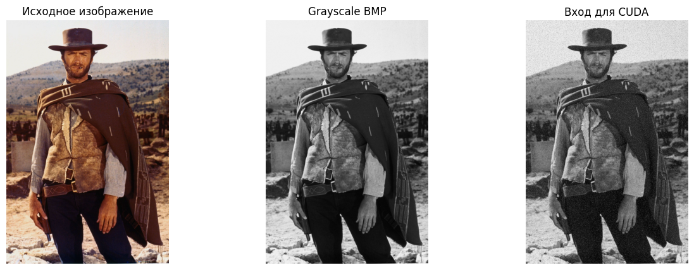

#### Зашумлённое и отфильтрованное изображения
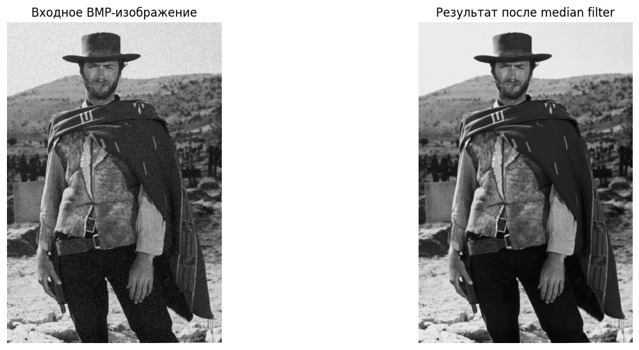

#### Сравнение original / noisy / filtered
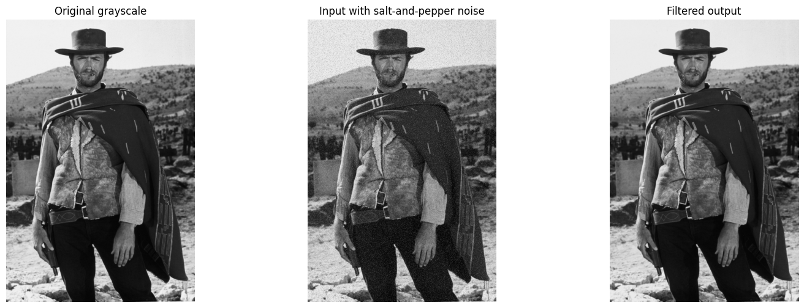

---

### Графики времени

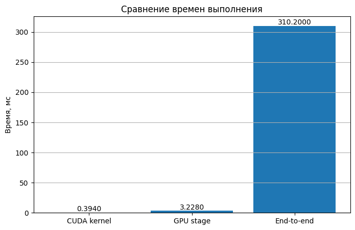

По графику видно, что:
- время CUDA kernel очень мало;
- GPU stage также остаётся небольшим;
- End-to-end заметно больше из-за операций ввода-вывода.

---

### Графики метрик качества

#### MSE
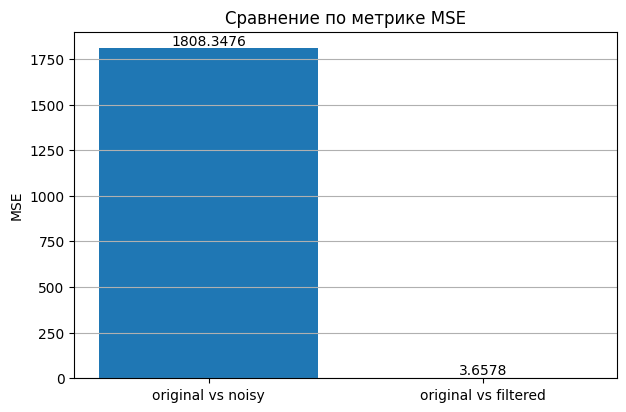

#### PSNR
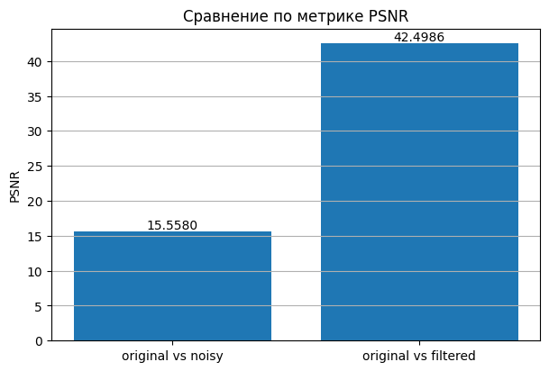

#### SSIM
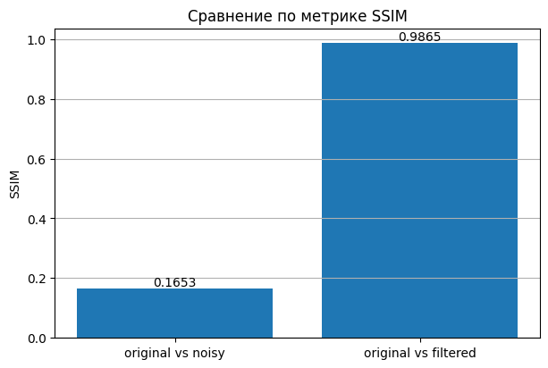

#### Доля экстремальных пикселей
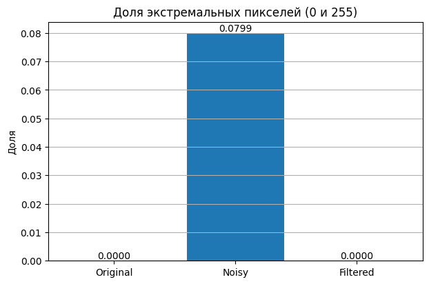

#### Гистограммы яркости
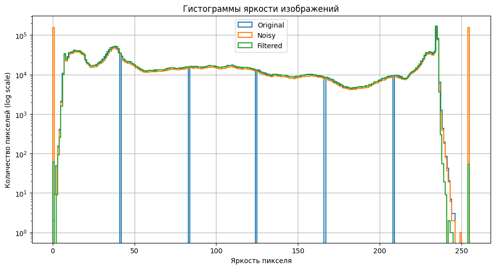

#### Карта абсолютной разности |Original - Noisy|
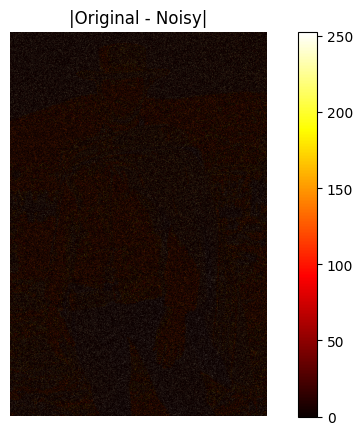

#### Карта абсолютной разности |Original - Filtered|
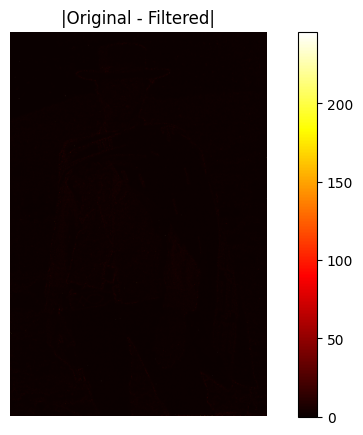

---

## Основные выводы по результатам

Можно сделать следующие выводы:

1. Реализованный 9-точечный медианный фильтр на CUDA **корректно удаляет шум salt-and-pepper**.
2. Использование схемы **1 поток = 1 пиксель** является естественным и эффективным способом распараллеливания данной задачи.
3. Применение **texture memory** удобно для работы с двумерным изображением и позволяет корректно обработать границы с помощью режима `clamp`.
4. Основное вычисление на GPU занимает очень малое время: **0.394 мс**.
5. Даже с учётом копирования данных и создания texture object GPU-этап составляет всего **3.228 мс**.
6. Полное время **310.200 мс** в основном обусловлено файловым вводом-выводом, а не самим алгоритмом фильтрации.
7. Количественные метрики качества (`MSE`, `PSNR`, `SSIM`) и визуальный анализ подтверждают высокую эффективность фильтра.

---

## Финальный вывод

В лабораторной работе был реализован CUDA-вариант **9-point median filter** для удаления шума типа **salt-and-pepper** с использованием **texture memory**.

Было показано, что данная задача хорошо распараллеливается, поскольку обработка каждого пикселя может выполняться независимо. В реализации каждый поток GPU вычисляет значение одного выходного пикселя, считывая локальное окно `3×3`, сортируя 9 значений и выбирая медиану.

Полученные результаты показывают, что программа работает корректно:
- шум эффективно удаляется;
- структура изображения сохраняется;
- метрики качества значительно улучшаются;
- вычислительная часть на GPU выполняется очень быстро.

Таким образом, поставленная задача решена, а цель работы — знакомство с разработкой CUDA-приложений и использованием texture memory — достигнута. Ура!

